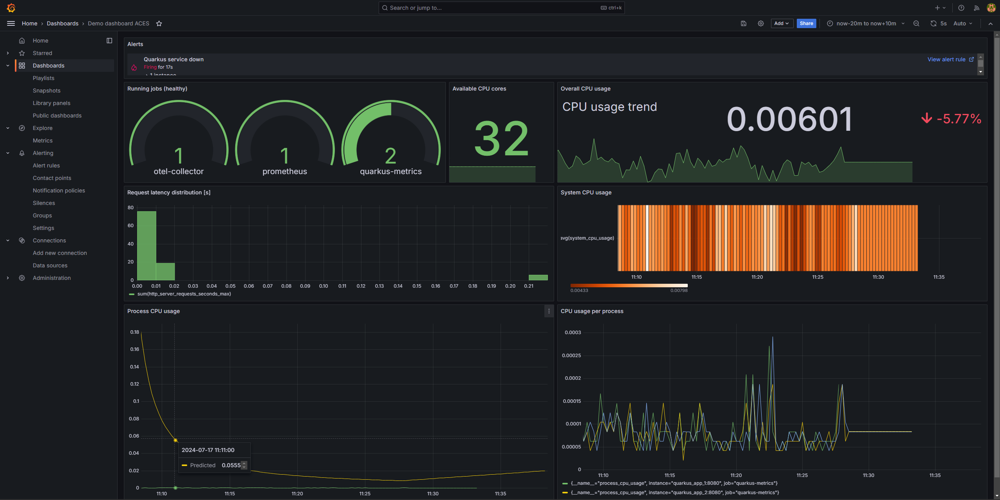

# Monitoring and Observability component

[](https://www.gnu.org/licenses/gpl-3.0)
[](https://github.com/ACES-EU/kc-monitoring-observability/actions/workflows/test.yml)

Monitoring and Observability is an ACES kernel component that delivers comprehensive monitoring and observability capabilities across various software stack layers, including edge, application, network, and cloud. In that, it ensures proactive issue identification and resolution, ultimately promoting smooth operations and optimal resource utilization. The ACES Monitoring and Observability component utilizes open-source tools to achieve comprehensive telemetry collection from ACES assets and instrumented applications. These assets, encompassing workloads, clusters, infrastructure elements, and applications, generate various data sources like metrics, logs, and traces. The collected data undergoes analysis for anomaly detection and alert generation. This processed information is then strategically distributed across all ACES components, facilitating real-time system-wide visibility for informed decision-making.


As shown in the architecture, the component is composed of the following functionalities and subcomponents:

|Component|Functionality / Sub-Component|Functionality Description|Technologies Used|
|:----|:----|:----|:----|
|Monitoring and Observability component|Instrumentation & export|Instruments the applications and exports the metrics, logs, telemetry.|OpenTelemetry API/SDK and collector (instrumentation, exporter), KumuluzEE, KumuluzEE Metrics Extension|
| |Telemetry collector|A proxy to receive, process and export telemetry data to the monitoring backend.|OpenTelemetry collector|
| |Monitoring system|Monitoring backend, ingression of metrics, anomaly detection, alerting, analysis, and visualization.|Prometheus|
| |Forwarder|Ingests/converts monitoring and telemetry data and dispatches them to the event store/processing.|prometheus-nats-adapter|
| |ETL/stream aggregation|Data aggregation and transformation service.|KumuluzEE, jnats NATS Java Client|
| |Visualization|Monitoring and observability data visualization and analysis.|Grafana|
|Event store and stream processing||Raw and aggregated event and metric/telemetry dispatch to other ACES components.|NATS Jetstream|


## Prerequisites

- [docker](https://docs.docker.com/get-docker/)
- [minikube](https://minikube.sigs.k8s.io/docs/start/)
- [kubectl](https://kubernetes.io/docs/tasks/tools/install-kubectl/)

## Running the application

### Running the application in dev mode

You can deploy an entire application using docker-compose. All the docker images are already built and pushed to the docker hub.

```shell script
docker-compose up -d

# stop the services
docker-compose down
```

### Deploying and running the application in minikube

You can deploy the application to minikube using the following commands:

```shell script
minikube delete --all

minikube start

#create namespace ul
kubectl create namespace ul

# move to minikube context
kubectl config use-context minikube

# move the namespace to ul
kubectl config set-context --current --namespace=ul

# deploy the rest of the services
kubectl apply -f deployment/k8s -n ul

# wait for the services to be ready
kubectl wait pod --for=condition=Ready --all --timeout=300s -n ul

# go to grafana web page (username: admin, password: admin)
minikube service grafana -n ul

# check logs of a service
kubectl logs -f <service-name> -n ul
```

### Deploying and running the application in minikube with Helm

You can deploy the application to minikube using the following commands:

```shell script
minikube delete --all

minikube start

#create namespace ul
kubectl create namespace ul

# move to minikube context
kubectl config use-context minikube

# move the namespace to ul
kubectl config set-context --current --namespace=ul

# deploy the rest of the services
helm upgrade --install monitoring-observability ./charts/app -n ul --post-renderer ./charts/app/add-common-labels.sh

# wait for the services to be ready
kubectl wait pod --for=condition=Ready --all --timeout=300s -n ul

# go to grafana web page (username: admin, password: admin)
minikube service grafana -n ul

# check logs of a service
kubectl logs -f <service-name> -n ul
```

### Deploying and running the application in AWS

You can deploy the application to AWS using the following commands (you need to have config.yaml file in the root directory):

```shell script
kubectl --kubeconfig=config.yaml get pods -n ul -v=6
helm list --kubeconfig=config.yaml -n ul
kubectl --kubeconfig=config.yaml config use-context ul@aces-1
helm package charts/app --destination charts
helm upgrade --install monitoring-observability ./charts/app --kubeconfig=config.yaml -n ul --post-renderer ./charts/app/add-common-labels.sh
kubectl --kubeconfig=config.yaml port-forward -n ul pod/prometheus-server-66476d778f-q8kct 9090:9090
kubectl --kubeconfig=config.yaml logs -f -n ul prometheus-nats-adapter-5c6b7d4c8b-2qj5g
kubectl port-forward svc/prometheus-service 9090:80 --kubeconfig=config.yaml -n ul
```

## Demonstration

For evaluation purposes, a system with three Quarkus microservices, an OpenTelemetry collector, a Prometheus and  instance and KumuluzEE Java aggregation microservice with an additional Grafana dashboard is created. Prometheus is collecting data from microservices and OpenTelemetry collector and feds it into NATS using the Prometheus NATS Adapter. This data is then read by a KumuluzEE Java microservice, which also produces four topics that aggregate the collected data.

We have created a NATS stream named `prometheus`. It contains two types of topics: the ones with raw data (`metrics.*`) and the ones with aggregated data (`aggregated_metrics.*`).

When deployed we can see a Grafana dashboard (assets available in `/demo-resources` directory):




### Demo components

- **Asset demo 1**: A dummy Quarkus service that produces random metrics. It's accessible on port 8082.

- **Asset demo 2**: A dummy Quarkus service that produces random metrics. It's accessible on port 8083.

- **Asset demo 3**: A dummy Quarkus service that produces random metrics. It's accessible on port 8084.

- **Prometheus**: Monitoring and alerting toolkit. It's configured with a custom configuration file and accessible on port 9090. It's set up to scrape metrics from the dummy services.

- **Nats Jetstream**: A NATS streaming server that is used for event dispatching. It's accessible on port 4222.

- **Prometheus Nats Adapter**: A service that reads metrics from Prometheus and dispatches them to NATS. It's accessible on port 5000.

- **Aggregation Service**: A service that produces and consumes from the Nats Jetstream. It's accessible on port 8085.

- **OpenTelemetry collector**: Exposes a telemetry collection endpoint that is fed into the system. Exposed on port 8888.

- **Grafana**: A visualization and dashboarding tool. It is accessible on port 3000.
---

## License

This project is licensed under the terms of the GNU General Public License v3.0. See the [LICENSE](LICENSE) file for details.

© 2024 Faculty of Computer and Information Science, University of Ljubljana
